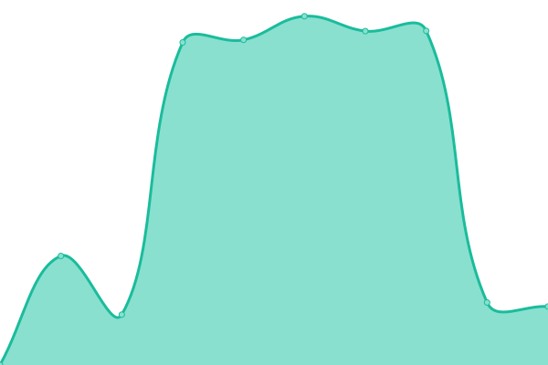

# [📈 Live Status](https://status.oliverilp.ee): <!--live status--> **🟩 All systems operational**

This repository contains the open-source uptime monitor and status page for [Oliver Ilp](https://status.oliverilp.ee), powered by [Upptime](https://github.com/upptime/upptime).

With [Upptime](https://upptime.js.org), you can get your own unlimited and free uptime monitor and status page, powered entirely by a GitHub repository. We use [Issues](https://github.com/oliverilp/upptime/issues) as incident reports, [Actions](https://github.com/oliverilp/upptime/actions) as uptime monitors, and [Pages](https://status.oliverilp.ee) for the status page.

<!--start: status pages-->
<!-- This summary is generated by Upptime (https://github.com/upptime/upptime) -->
<!-- Do not edit this manually, your changes will be overwritten -->
<!-- prettier-ignore -->
| URL | Status | History | Response Time | Uptime |
| --- | ------ | ------- | ------------- | ------ |
|  [Memos](https://memos.oliverilp.ee/) | 🟩 Up | [memos.yml](https://github.com/oliverilp/upptime/commits/HEAD/history/memos.yml) | 

 1055ms
     
 | 

<a href="https://status.oliverilp.ee/history/memos">96.95%</a>
    

|  [Jellyfin](https://crunchyroll.ee/) | 🟩 Up | [jellyfin.yml](https://github.com/oliverilp/upptime/commits/HEAD/history/jellyfin.yml) | 

 1153ms
     
 | 

<a href="https://status.oliverilp.ee/history/jellyfin">96.95%</a>
    

|  [Photos](https://photos.oliverilp.ee/) | 🟩 Up | [photos.yml](https://github.com/oliverilp/upptime/commits/HEAD/history/photos.yml) | 

 1255ms
     
 | 

<a href="https://status.oliverilp.ee/history/photos">82.49%</a>
    

<!--end: status pages-->

[**Visit our status website →**](https://status.oliverilp.ee)

## 📄 License

- Powered by: [Upptime](https://github.com/upptime/upptime)
- Code: [MIT](./LICENSE) © [Anand Chowdhary](https://anandchowdhary.com), supported by [Pabio](https://pabio.com)
- Data in the `./history` directory: [Open Database License](https://opendatacommons.org/licenses/odbl/1-0/)
