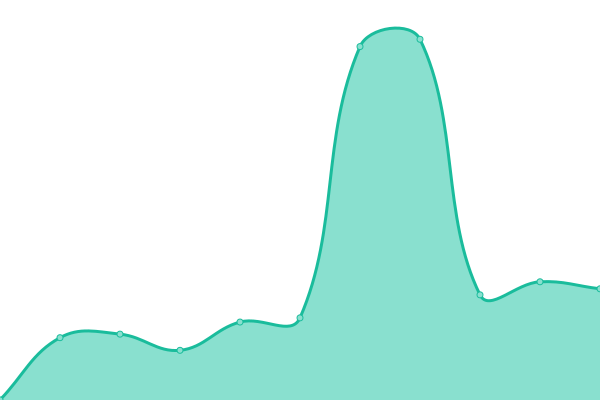
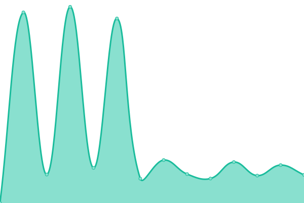
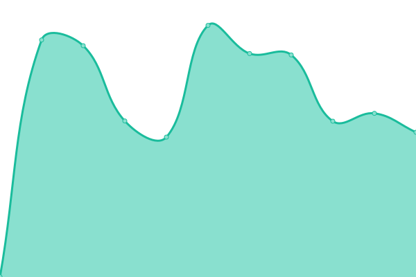
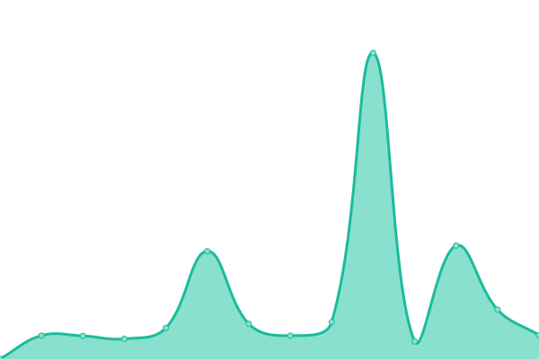

# [📈 Live Status](https://status.oliverilp.ee): <!--live status--> **🟧 Partial outage**

This repository contains the open-source uptime monitor and status page for [Oliver Ilp](https://status.oliverilp.ee), powered by [Upptime](https://github.com/upptime/upptime).

With [Upptime](https://upptime.js.org), you can get your own unlimited and free uptime monitor and status page, powered entirely by a GitHub repository. We use [Issues](https://github.com/oliverilp/upptime/issues) as incident reports, [Actions](https://github.com/oliverilp/upptime/actions) as uptime monitors, and [Pages](https://status.oliverilp.ee) for the status page.

<!--start: status pages-->
<!-- This summary is generated by Upptime (https://github.com/upptime/upptime) -->
<!-- Do not edit this manually, your changes will be overwritten -->
<!-- prettier-ignore -->
| URL | Status | History | Response Time | Uptime |
| --- | ------ | ------- | ------------- | ------ |
|  [Nextcloud](https://cloud.oliverilp.ee/) | 🟥 Down | [nextcloud.yml](https://github.com/oliverilp/upptime/commits/HEAD/history/nextcloud.yml) | 

 1148ms
     
 | 

<a href="https://status.oliverilp.ee/history/nextcloud">92.21%</a>
    

|  [Memos](https://memos.oliverilp.ee/) | 🟩 Up | [memos.yml](https://github.com/oliverilp/upptime/commits/HEAD/history/memos.yml) | 

 1049ms
     
 | 

<a href="https://status.oliverilp.ee/history/memos">97.99%</a>
    

|  [Jellyfin](https://crunchyroll.ee/) | 🟩 Up | [jellyfin.yml](https://github.com/oliverilp/upptime/commits/HEAD/history/jellyfin.yml) | 

 1350ms
     
 | 

<a href="https://status.oliverilp.ee/history/jellyfin">97.63%</a>
    

|  [Komga](https://manga.crunchyroll.ee/) | 🟩 Up | [komga.yml](https://github.com/oliverilp/upptime/commits/HEAD/history/komga.yml) | 

 1955ms
     
 | 

<a href="https://status.oliverilp.ee/history/komga">97.80%</a>
    

<!--end: status pages-->

[**Visit our status website →**](https://status.oliverilp.ee)

## 📄 License

- Powered by: [Upptime](https://github.com/upptime/upptime)
- Code: [MIT](./LICENSE) © [Anand Chowdhary](https://anandchowdhary.com), supported by [Pabio](https://pabio.com)
- Data in the `./history` directory: [Open Database License](https://opendatacommons.org/licenses/odbl/1-0/)
